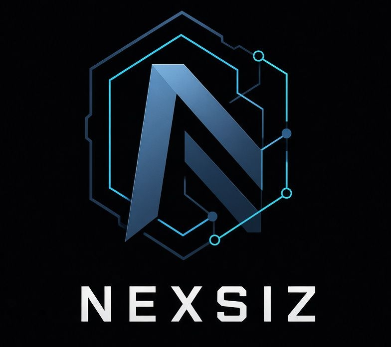

# Nexsiz Fuzzing 

<p align="center">
  
</p>

### Stateful Network Protocol Fuzzer

**Nexsiz** is a high-performance, modular, pure Rust-based network protocol fuzzer designed for deep network protocol testing. It is purpose-built to explore the deepest regions of a protocol's state machine—areas where conventional fuzzers miss structural validity or state context and consequently remain blind.

Design priorities are explicit: precision over volume, structural integrity after mutation, hybrid black/grey-box feedback, and operational resilience under realistic network conditions.

> Offensive tooling must execute correctly, remain maintainable under operational pressure, and preserve the operator’s ability to reason about the exact behaviour the target exhibited.

---

## Current Status

| Item | Value |
|------|-------|
| Version | `0.1.0` |
| Maturity | Operational / experimental |
| Primary platform | Linux (x86_64) |
| Default dependencies | `libc` only |
| Optional features | `libafl`, `json-model`, `criu` |
| License | Apache-2.0 |

**Known limitations (v0.1.0)**
- Frida / shared-memory coverage and CRIU snapshot are Linux-only.
- Snapshot restore is Phase-1 (process kill+respawn or CRIU); full desocketing is ongoing.
- Webhook NXS uses a pure-stdlib HTTP client (no HTTPS); terminate TLS at a local proxy if needed.
- Rate limits and cooldowns are conservative by default — tune for your environment.

Always run against isolated targets under explicit authorisation.

---

## Design Principles

| Principle | Implementation |
|-----------|----------------|
| Semantic-preserving mutation | Hierarchical field / message / sequence mutators that respect protocol grammar |
| Protocol-aware integrity repair | Automatic restoration of length fields, checksums, framing, and terminators after mutation |
| Hybrid state model | Black-box response observation combined with true grey-box edge coverage |
| Grey-box instrumentation | `CoverageProvider` trait, AFL-style shared-memory edge map, external Frida agent |
| Intelligent connection reuse | Stateful TCP reuse with safety-prefix detection to prevent cross-test contamination |
| Adaptive transition prediction | Lightweight predictor that biases mutation scheduling toward promising state transitions |
| Minimal dependency surface | Default build depends only on `libc`; LibAFL / JSON models are gated behind optional feature flags |
| Trait-based extensibility | Protocol, Integrity, Oracle, and Encryptor plugins may be registered without core changes |
| Differential & sanitizer oracles | Multi-dimensional behavioural divergence and memory-safety / protocol-anomaly detection |
| NXS existence scripts | Post-event executable actors with rate-limited, non-blocking spawn and asynchronous exit observation |
| Operator-defined field trees | JSON protocol models (feature `json-model`) — define length/checksum/command layout without recompile |
| Offline grammar inference | `--infer-model` extracts delimiter, length-prefix, and tokens from seed corpora |

---

## Protocol Models

Built-in models (no extra features required):

| Name | Notes |
|------|-------|
| `generic` | Default opaque binary |
| `ftp` / `smtp` / `http` | Classic text protocols + CRLF integrity |
| `dns` | TCP length-prefix + 12-byte header + QNAME/QTYPE/QCLASS |
| `mqtt` | Fixed header + remaining length + CONNECT/PUBLISH templates |
| `smb` / `cifs` | NetBIOS session + SMB1/SMB2 magic + command dictionary |
| `binary-lp` / `lp` | Generic 2-byte BE length-prefix + optional CRC32 |
| `binary-lp-le` / `lp-le` | Same, little-endian |

Grammar-enriched aliases: `grammar-ftp`, `g-dns`, `grammar-mqtt`, `g-smb`, …

### Operator-Defined Models (JSON)

```bash
# Build with JSON support
cargo build --release --features json-model

# Use a custom field tree
./target/release/nexsiz -h 10.0.0.5 -p 1883 -m models/mqtt.json -v
./target/release/nexsiz -h 10.0.0.5 -p 445  -m models/custom-example.json -v
```

Example schema (`models/custom-example.json`):

```json
{
  "name": "custom-example",
  "length_prefixed": true,
  "length_width": 4,
  "endian": "le",
  "checksum": "crc32",
  "dictionary": ["\\x01", "PING", "PONG"],
  "messages": [{
    "name": "request",
    "fields": [
      { "name": "len", "type": "Length", "size": 4, "endian": "le" },
      { "name": "opcode", "type": "Command", "size": 1, "values": ["\\x01", "\\x02"] },
      { "name": "payload", "type": "Binary" },
      { "name": "crc", "type": "Checksum", "size": 4 }
    ]
  }]
}
```

Integrity auto-selects `binary` / `binary-le` for `dns`, `mqtt`, `smb`, and `binary-lp*` models.

### Offline Grammar Inference

```bash
# Inspect seeds and print summary
./target/release/nexsiz --infer-model -s seeds/ftp -v

# Write inferred model (JSON when built with --features json-model)
./target/release/nexsiz --infer-model -s seeds/custom --infer-out models/inferred.json
```

Heuristics detect CRLF/LF delimiters, 2/4-byte length-prefix patterns, and printable tokens (≥3 chars). Output is a starting point — refine into a formal JSON model for production campaigns.

Field-aware mutation respects `FieldSpec.size` (pad/truncate), prefers `FieldSpec.values`, and avoids destructive edits on protected / Length / Checksum fields.

---

## NXS — Existence After Discovery

Once the engine surfaces a crash, hang, or other interesting event, optional **NXS** binaries deepen the finding without increasing the size or complexity of the fuzzer core.

| Identifier | Role |
|------------|------|
| `crash/auto-repro` | Deterministic replay (prefers minimised input) |
| `crash/save-notify` | Artefact archival + optional external notification command |
| `crash/differential-probe` | Bounded variant probes against a known-good baseline |
| `crash/state-diff` | Multi-shot response signature comparison (class, hash, length, timing, status codes) |
| `crash/coverage-probe` | Path-diversity behavioural probe (fingerprints as coverage proxy) |
| `crash/auth-bypass` | Protocol-aware auth sequence injection (FTP / SMTP / HTTP heuristics) |
| `hang/timeout-analyzer` | Multi-shot classification of hard hangs |
| `external/notify-webhook` | Compact HTTP POST of event metadata |

```bash
cd nxs && ./build.sh
nexsiz -h 10.0.0.5 -p 21 -m ftp --nxs default -v
nexsiz --nxs intrusive --nxs-list
cd nxs && ./tests/e2e.sh
```

Contract, search-path resolution, and rate-limit controls are documented in [`nxs/README.md`](nxs/README.md) and [`nxs/CONTRACT.md`](nxs/CONTRACT.md).

---

## Architecture

```
┌─────────────────────────────────────────────────────────────────┐
│                  Monitoring · Oracle · NXS                        │
│  crash / hang detection · differential & sanitizer oracles       │
│  minimizer · structured logging · existence-script spawn         │
└───────────────────────────────┬─────────────────────────────────┘
                                │
┌───────────────────────────────┴─────────────────────────────────┐
│                 Execution & Efficiency Layer                     │
│  worker pool · intelligent connection reuse · TCP / UDP          │
│  process monitor · optional LibAFL Executor + LLMP Launcher      │
└───────────────────────────────┬─────────────────────────────────┘
                                │
┌───────────────────────────────┴─────────────────────────────────┐
│             State Awareness + Coverage Feedback                  │
│  hybrid state tracker · adaptive transition predictor            │
│  CoverageProvider (null | map+shm | software)                    │
└───────────────────────────────┬─────────────────────────────────┘
                                │
┌───────────────────────────────┴─────────────────────────────────┐
│                      Input Construction                          │
│  semantic field model · hierarchical mutator                     │
│  protocol-aware integrity repair pipeline                        │
│  optional LibAFL Mutator adapter                                 │
│  JSON field trees (feature json-model)                           │
│  offline grammar inference (--infer-model)                       │
└─────────────────────────────────────────────────────────────────┘
```

---

## Build & Quick Start

```bash
# Default (minimal dependencies)
cargo build --release

# Optional LibAFL path
cargo build --release --features libafl

# Optional JSON protocol models
cargo build --release --features json-model

# Combined
cargo build --release --features "libafl,json-model"

# Minimal seed corpus
mkdir -p seeds/ftp
echo -e "USER anonymous\r\nPASS guest\r\nPWD\r\nQUIT\r\n" > seeds/ftp/login.txt

# Basic campaign
./target/release/nexsiz \
  -h 127.0.0.1 -p 21 -m ftp \
  -s seeds/ftp -o output/ftp -v -x 50000

# DNS / MQTT / SMB campaigns
./target/release/nexsiz -h 10.0.0.5 -p 53  -m dns  -P tcp -v
./target/release/nexsiz -h 10.0.0.5 -p 1883 -m mqtt -v
./target/release/nexsiz -h 10.0.0.5 -p 445  -m smb  -v

# Infer model from seeds
./target/release/nexsiz --infer-model -s seeds/ftp -v
./target/release/nexsiz --infer-model -s seeds/custom --infer-out models/inferred.json

# Campaign with NXS deepening
cd nxs && ./build.sh && cd ..
./target/release/nexsiz -h 127.0.0.1 -p 21 -m ftp --nxs default -v

# Deep campaign (intrusive NXS set)
./target/release/nexsiz -h 10.0.0.5 -p 21 -m ftp --nxs intrusive --nxs-cooldown 60 -v

# Local target + process snapshot (kill+respawn)
./target/release/nexsiz -t "./mydaemon" -Z --snapshot-backend process -m ftp -v
```

---

## Command-Line Interface

```
nexsiz [OPTIONS]
```

### Target

| Flag | Description | Default |
|------|-------------|---------|
| `-h`, `--host <ADDR>` | Target host | `127.0.0.1` |
| `-p`, `--port <PORT>` | Target port | `80` |
| `-P`, `--proto <PROTO>` | Transport protocol: `tcp` \| `udp` | `tcp` |
| `-t`, `--cmd <CMD>` | Spawn target process for local crash monitoring / snapshot | — |
| `-T`, `--timeout <MS>` | Per-operation timeout (milliseconds) | `500` |

### Protocol & Plugins

| Flag | Description |
|------|-------------|
| `-m`, `--model <NAME>` | Protocol model: `ftp` \| `smtp` \| `http` \| `generic` \| `dns` \| `mqtt` \| `smb` \| `binary-lp` \| `binary-lp-le` \| path/to/model.json |
| `-O`, `--oracle <NAME>` | Oracle: `default` \| `strict` \| `crash` \| `hang` \| `coverage` \| `differential` \| `sanitizer` \| `diffsan` \| `expanded` |
| `-i`, `--int <NAME>` | Integrity strategy: `default` \| `http` \| `ftp` \| `smtp` \| `binary` \| `binary-le` \| `null` |
| `-e`, `--enc <NAME>` | Encryptor: `null` \| `xor` \| `chacha20` \| `tls-record` \| `chacha20+tls` \| `xor+tls` |
| `-k`, `--key <KEY>` | Encryptor key (hex `0x…` or raw string) |

**Oracle notes**

| Name | Behaviour |
|------|-----------|
| `differential` / `diff` | Multi-dimensional behavioural divergence |
| `sanitizer` / `san` | ASan/UBSan patterns, length anomaly, null-byte, protocol violation |
| `diffsan` | differential + sanitizer + coverage (recommended for deep campaigns) |
| `expanded` | diffsan + error oracle (maximum sensitivity) |

### Model Inference

| Flag | Description |
|------|-------------|
| `--infer-model` | Infer protocol model from `-s` seed directory and exit |
| `--infer-out <PATH>` | Write inferred model (JSON with `json-model` feature, else human dump) |

### Coverage

| Flag | Description | Default |
|------|-------------|---------|
| `-C`, `--cov <NAME>` | Coverage provider: `null` \| `map` \| `software` | `null` |
| `-S`, `--shm <ID>` | Shared-memory id for Frida agent (`/nexsiz-cov-<ID>`) | — |

Environment: `NEXSIZ_SHM_ID`.

### Campaign Control

| Flag | Description | Default |
|------|-------------|---------|
| `-w`, `--workers <N>` | Worker threads | number of cores |
| `-s`, `--seed <DIR>` | Seed directory | `seeds` |
| `-o`, `--out <DIR>` | Output directory | `output` |
| `-c`, `--config <FILE>` | Load key=value configuration file | — |
| `-Y`, `--rpc <PATH>` | Unix domain socket for Python/RPC campaign control | — |
| `-n`, `--no-reuse` | Disable intelligent connection reuse | reuse enabled |
| `-r`, `--rng <N>` | Deterministic RNG seed | — |
| `-L`, `--libafl` | Use LibAFL path (requires `--features libafl`) | native path |

Environment: `NEXSIZ_RPC_SOCK` (same as `-Y`).

### Snapshot / Process Management

| Flag | Description | Default |
|------|-------------|---------|
| `-Z`, `--snapshot` | Enable process snapshot / restore | disabled |
| `--snapshot-backend <B>` | Backend: `null` \| `process` \| `criu` | `process` (when `-Z` is set) |

- `process` — kill + respawn the target on crash (requires `-t/--cmd`).
- `criu` — CRIU dump/restore (requires `--features criu` and `criu` on `PATH`).
- Snapshot implies local process control; combine with `-t`.

### Execution Limits

| Flag | Description |
|------|-------------|
| `-x`, `--execs <N>` | Stop after N executions |
| `-R`, `--runtime <SECS>` | Stop after SECS seconds |

### NXS (Existence Scripts)

| Flag | Description | Default |
|------|-------------|---------|
| `--nxs <EXPR>` | Enable NXS set (`default`, `crash`, `hang`, `safe`, `intrusive`, `external`, or concrete ids) | disabled |
| `--nxs-path <DIRS>` | Extra colon-separated search directories | — |
| `--nxs-cooldown <SECS>` | Cooldown per (event, crash, nxs) tuple | `30` |
| `--nxs-max-per-event <N>` | Cap spawns per event type (`0` = unlimited) | `0` |
| `--nxs-max-total <N>` | Cap total NXS spawns for the campaign (`0` = unlimited) | `0` |
| `--nxs-list` | Resolve selected set, print found/missing paths, then exit | — |

Environment: `NEXSIZ_NXS`, `NEXSIZ_NXS_PATH`.  
Default events: `crash`, `hang` (override via config `nxs_events=…`).

### General

| Flag | Description |
|------|-------------|
| `-v`, `--verbose` | Verbose logging |
| `-?`, `--help` | Show help |
| `-V`, `--version` | Show version |

### Environment Variables

| Variable | Purpose |
|----------|---------|
| `NEXSIZ_ENC_KEY` / `NEXSIZ_ENC_NONCE` | Encryptor key material |
| `NEXSIZ_SHM_ID` | Coverage shared-memory identifier |
| `NEXSIZ_RPC_SOCK` | RPC control socket path |
| `NEXSIZ_NXS` | Equivalent to `--nxs` |
| `NEXSIZ_NXS_PATH` | Equivalent to `--nxs-path` |

### Examples

```bash
nexsiz -h 127.0.0.1 -p 21 -m ftp -s seeds/ftp -o out/ftp -v
nexsiz -h 127.0.0.1 -p 21 -m ftp --nxs default -v
nexsiz --nxs default --nxs-list
nexsiz -h 10.0.0.5 -p 21 -m ftp --nxs intrusive --nxs-cooldown 60 -v
nexsiz -h 127.0.0.1 -p 21 -m ftp -C map --shm demo -Y /tmp/nexsiz.sock -v
nexsiz -h 10.0.0.5 -p 53 -m dns -P tcp -v
nexsiz -h 10.0.0.5 -p 1883 -m mqtt -v
nexsiz -h 10.0.0.5 -p 445 -m smb -v
nexsiz --infer-model -s seeds/ftp -v
nexsiz --infer-model -s seeds/custom --infer-out models/inferred.json
nexsiz -h 10.0.0.5 -p 1234 -m models/custom-example.json -v   # needs --features json-model
nexsiz -t "./target_daemon" -Z --snapshot-backend process -m ftp -v
nexsiz -t "./target_daemon" -Z --snapshot-backend criu -m ftp -v   # needs --features criu
```

---

## Output Layout

```
output/
├── crashes/          # Crashing inputs (and .min when minimisation succeeds)
├── hangs/
├── nxs-meta/         # Metadata JSON written prior to each NXS spawn
├── nxs-out/          # Per-event NXS artefact trees (report.json, …)
├── nxs-findings/     # Secondary findings (exit code 2) in JSONL form
└── queue/
```

---

## Operational Notes

- Clean residual shared-memory maps after campaigns: `rm -f /dev/shm/nexsiz-cov*`.
- Prefer `-C software` when the target is remote-only (no local process for Frida).
- NXS spawns are non-blocking; the background reaper observes exit codes asynchronously.
- Exit code 2 from any NXS is treated as a secondary finding and recorded in `nxs-findings/secondary.jsonl`.

---

## License

Apache License 2.0. Intended for operational use by offensive security teams under explicit authorisation and in isolated environments.

---

## Documentation

[](https://revanakit.github.io/nexsiz-blogs/)

## Author

[](https://github.com/revanakit)
